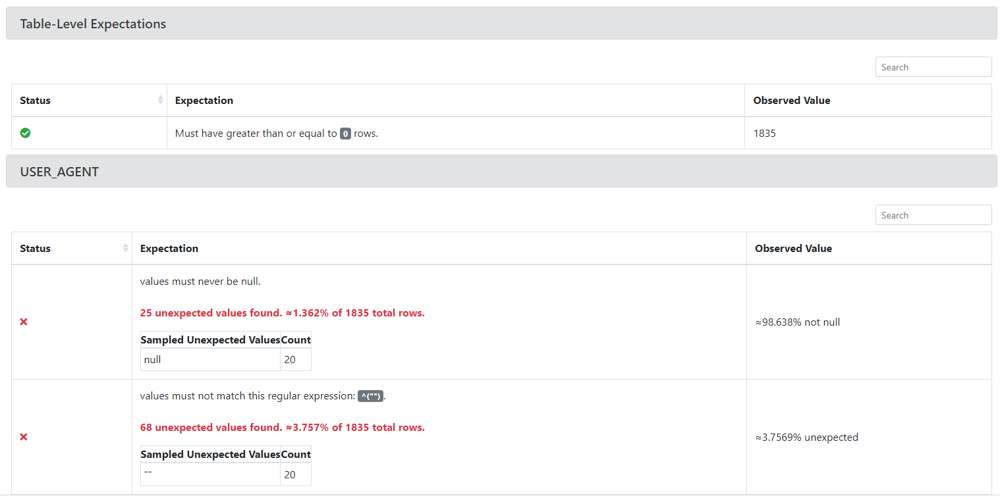
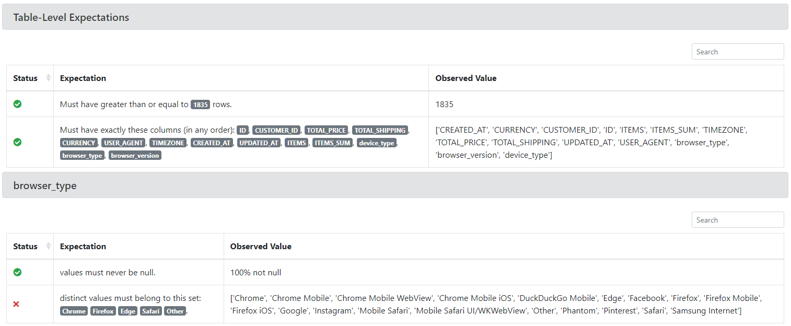
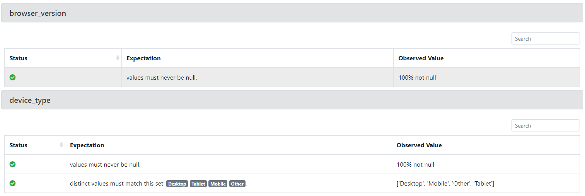

# Black Crow AI Challenge

Welcome to my solution to the Black Crow AI challenge!

I tried to solve this challenge using my skills with Python, PySpark and Data in general, putting into practice concepts that I would use in real life scenarios in a production environment. Some of the stuff that I implemented may seem like an overkill, but I thought about the scalability of the solution, reusability and overall code quality.

All of the data inputs that I've used and the outputs that I produced are located in the `data/` folder in the root of this project:
- `sample_orders.json.gz`: data provided for this challenge
- `processed_orders/processed_orders.json.gz`: the final result dataset with the solution
- `great_expectations_configs/`: folder containing data quality configurations and reports
    - `data-docs`: HTML data quality reports on the input data and on the solution file
    - `validations`: same content of the `data-docs` folder, but in raw json format
    - Rest of the folders: data quality configurations used with Great Expectations

Below are some definitions of this challenge, how I solved it, how I structured the project and how you can run this solution on your end.

## Table of Contents
- [Challenge Definition](#challenge-definition)
- [Solution](#solution)
- [How to Run](#how-to-run)

## Challenge Definition

### Background


Attached you’ll find a file called sample_orders.json.gz that’s a gzipped file in the JSON-Lines format.  This file contains sample user order events from an ecommerce website that are pulled from an API.  

### Problem

For this coding assignment, we want you to get familiar with the code by augmenting the data. Inside the sample_orders.json.gz file, you will find a `USER_AGENT` column.  We would like you to parse the `USER_AGENT`  and derive three new columns:


1. Device Type (Mobile, Computer, Tablet, Other, etc)

2. Browser Type (Safari, Firefox, etc)

3. Browser Version 


### Requirements and Rules

- You can use any publicly available libraries (recommend for the user-agent parsing)
- The app should read the sample_orders.json.gz  file, and write a new file with the additional columns called sample_orders_transformed.json.gz 
- Add some tests to prove the newly added functionality is working properly 
- There may be some data quality issues.  Please be explicit in tests / logic with how you handle them. 
- Add a README w/ instructions on how to setup / run your submission

Please implement your solution in Python, Scala, or Java

## Solution

To solve this challenge, I tried to break down the problem in smaller parts:
- Data exploration, get familiar with the shape of the data and with data quality issues
- Defining and implementing the tools to solve the problem with ease of use and scalability
- Solving the problem using the tools I built
- Running a final data quality analysis on the result to confirm that the output is in fact correct

### Data Exploration

In this first step I mainly used Great Expectations data quality reports to aid me in the data exploration. Some ad-hoc stuff was done too, but to document what I was analyzing, GE was the best option for me. With it, I created some HTML pages containing the data quality reports on the table size and on the data on the `USER_AGENTS` field.

I aimed to identify the size of the dataset and if there were any null values or empty strings. Nulls and empty strings would probably break any future parsing, so identifying them was the priority.

The data quality checks on the source file were done using the file `data/great_expectations_configs/expectations/input_orders_expectations.json`. The file is pretty self explanatory and each quality check is documented.

The output of the quality checks is located in the file `data/great_expectations_configs/data-docs/validations/input_orders_expectations/20231118-211106/20231118T211106.148093Z/af35d146696767d8c2301c13e006922c.html` and reveals the following:

.

About the `USER_AGENT` column:
- We have 1835 rows to work with. Looking at the problem, we should expected the same number of rows in the output, and if not, something went wrong
- We have 25 rows with null values that will require some sort of data imputation
- We have 68 rows with empty strings that will probably need special attention

With this, I can solve the problem by doing:
- Data imputation on the null values. I thought about filling them with empty strings
- Deal with the empty strings as an incomplete user agent string, where the values for the 3 columns will be: "Other".
- Parse the rest of the rows normally

### The tools implemented for this solution

Before implementing anything, I defined my base requirements:
- I'll be using Python 3.11.x
- Processing engine will be Spark with PySpark (scalable, plus I'm more proficient with it)
- User Agent parsing will be done using the `user-agents` package
- Data quality checks and reports will use the Great Expectations package

The framework I developed for this challenge tries to emulate an ETL flow with simple but useful generic execution steps. Each step can be a data source, sink or transform, leveraging PySpark's lazy loaded dataframes to build a configuration interface for easy usage.

Exploring the framework structure:
- `etl_builder/steps/`: definition of the generic step interface and all of the steps implemented for this challenge. Highlight on the `UserAgentParserTransform` that handles the main logic of the UA parsing
- `etl_builder/pipeline.py`: the main orchestration file, handles how to execute the sources, transforms and sinks in order. Also has some logging capabilities
- `etl_builder/data_quality/`: data quality code configuration to use Great Expectations
- `etl_builder/cli.py`: this and the other `cli.py` files are used to create a simple CLI interface to run the commands for this solution
- `etl_builder/pipelines/black_crow_ai_pipeline,py`: the pipeline configuration for the problem solution. Here it's possible to see the json reading configuration, the transformations used on the data, and the output configuration to json.

### The logic of the solution

As defined above, the first thing to do is get rid of the nulls:
```
FillNullTransform(
    id="fill_null_user_agent_string_with_empty_string",
    column_name="USER_AGENT",
    value='""',
),
```

Simply filling the null values with empty strings. Then, we parse the user agent strings:

```
UserAgentParserTransform(
    id="parse_ua_string",
    ua_string_column="USER_AGENT",
    output_column="parsed_ua_agent",
),
```

```
device_type = "Other"
if parsed_string.is_tablet:
    device_type = "Tablet"
elif parsed_string.is_mobile:
    device_type = "Mobile"
elif parsed_string.is_pc:
    device_type = "Desktop"
elif parsed_string.is_bot:
    device_type = "Bot"
```

For the device type, I used a simple logic:
- Check the `is_tablet`, `is_mobile`, `is_pc` and `is_bot` attributes of the parsed data to determine the device type
- If none of them is present, set the default value as `Other`

For the browser version, if an empty string is returned, set it to `Other`, otherwise use the provided version.

The browser type already comes correct, returning `Other` automatically.

And, for this solution to work, I used a PySpark UDF allowing me to use a custom Python native library inside the Spark context. This can also be used on production clusters, as long as the library is also installed on the cluster.

To get the result as proposed, with 3 columns for each piece of data, I used the transform:
```
FlattenNestedTransform(
    id="flatten_parsed_ua_field",
    column_name="parsed_ua_agent",
    subset=["device_type", "browser_type", "browser_version"],
    drop_original_column=True,
),
```

It flattens the nested result of the previous step and also deletes the original nested column since we won't need it anymore.

Finally, the result is written to an output compressed json file:
```
JsonFileSink(
    id="save_result_to_json_file",
    destination_file_path="data/processed_orders",
    write_options={"compression": "gzip"},
),
```

Because of PySpark's behavior when saving result files, the path `data/processed_orders` contains several files, but the desired result is always the file that ends with `json.gz`, where I renamed it to `processed_orders.json.gz`.

### Data quality checks

With the final result in hand, I defined a set of quality checks to assert that the result is correct for the cases that I observed. The file containing the checks is `data/great_expectations_configs/expectations/parsed_orders_expectations.json`. The result of those quality checks can be seen in the file `data/great_expectations_configs/validations/parsed_orders_expectations/20231118-210951/20231118T210951.840849Z/af35d146696767d8c2301c13e006922c.json`:




Here I can be sure that:
- The row count stayed the same
- The 3 new columns were added without deleting any original column
- None of the 3 columns have null values or empty strings, it's all valid results
- Although the browser type check failed with more browser types than I expected, the values observed seem to be all valid browser types.
- The device type also came as expected within the set of values that I defined, except for bot devices that were not present in the entire dataset.

This sums up my solution, hope you like it!

## How To Run

I've made a CLI to facilitate reproducing my steps for solution generation. This CLI can be used locally or with a docker image.

### Locally
On the project's root folder:

1. Install the project dependencies. This step requires Poetry 1.7.1
```
$ make requirements
```
2. Run the quality checks on the input data:
```
$ python -m etl_builder.cli data-quality execute data/sample_orders.json.gz input_orders_expectations
```
3. Run the pipeline:
```
$ python -m etl_builder.cli pipelines execute black_crow_ai_pipeline
```
4. Rename the resulting file that ends with `json.gz`:
```
$ mv data/processed_orders/long_file_name.json.gz data/processed_orders/processed_orders.json.gz
```
5. Run the quality checks on the output data:
```
$ python -m etl_builder.cli data-quality execute data/processed_orders/processed_orders.json.gz parsed_orders_expectations
```
6. Open the quality reports in your default browser:
```
$ open data/great_expectations_configs/data-docs/index.html
```

### Docker

For the docker solution, we'll need to map a volume to the project's `data/` folder to allow us to see the resulting files. For this example I assumed that the project's root folder is located at the `$HOME` path.

On the project's root folder:

1. Build the docker image
```
$ make build
```
2. Run the quality checks on the input data:
```
$ docker run --rm -v $HOME/black-crow-ai-challenge/data/:/black_crow_ai_challenge/data/ black_crow_ai_challenge data-quality execute data/sample_orders.json.gz input_orders_expectations
```
3. Run the pipeline:
```
$ docker run --rm -v $HOME/black-crow-ai-challenge/data/:/black_crow_ai_challenge/data/ black_crow_ai_challenge pipelines execute black_crow_ai_pipeline
```
4. Rename the resulting file that ends with `json.gz`:
```
$ mv data/processed_orders/long_file_name.json.gz data/processed_orders/processed_orders.json.gz
```
5. Run the quality checks on the output data:
```
$ docker run --rm -v $HOME/black-crow-ai-challenge/data/:/black_crow_ai_challenge/data/ black_crow_ai_challenge data-quality execute data/processed_orders/processed_orders.json.gz parsed_orders_expectations
```
6. Open the quality reports on your default browser:
```
$ open data/great_expectations_configs/data-docs/index.html
```
